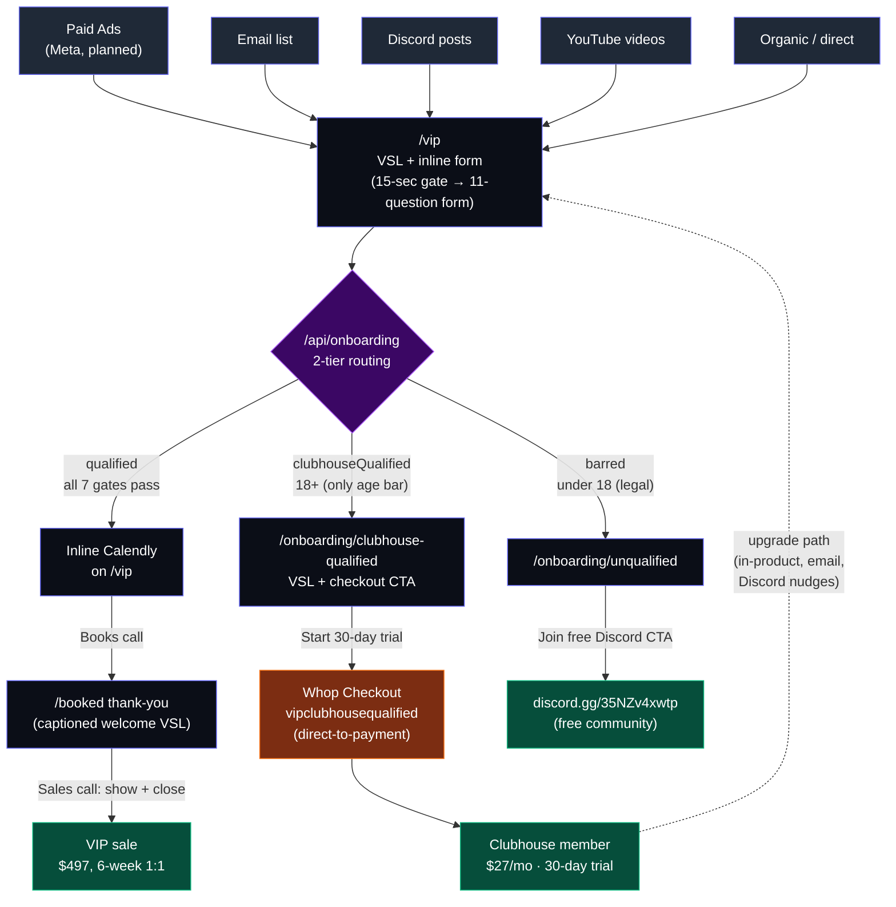

# Funnel Map

Every path from traffic source to terminal state across the VIP / Clubhouse funnel.

Three terminal states any visitor can land in:

1. **VIP sale** — $497, 6-week 1:1 with a pro coach. Reached via Calendly + sales call.
2. **Clubhouse member** — $27/mo with 30-day free trial. Reached via Whop checkout.
3. **Free Discord member** — fallback for under-18 visitors.

---

## Visual diagram (Mermaid)

Paste into [mermaid.live](https://mermaid.live) to render — nodes are clickable and open the live page in a new tab.



The dotted line from **Clubhouse member → /vip** is the upgrade loop: existing Clubhouse members can re-enter the VIP funnel at any time via in-product nudges, email campaigns, or Discord posts. They go through the same form and routing as any cold visitor — the form will route them to VIP qualified (if they meet all 7 gates) or back to the Clubhouse page (if they don't), but in the upgrade case they're already a member so the Clubhouse-qualified pitch reads differently.

---

## ASCII tree (plain-text version)

```
TRAFFIC SOURCES
├─ Paid Ads (Meta, planned)
├─ Email list
├─ Discord posts
├─ YouTube videos
├─ Organic / direct
└─ Existing Clubhouse members (upgrade loop)
                │
                ▼
            /vip  ← single top of funnel
            └─ 15-sec VSL gate (CTA locked until watched)
               └─ 11-question form (~60 sec)
                  └─ /api/onboarding → 2-tier routing
                     │
                     ├─ QUALIFIED  (all 7 gates pass)
                     │   └─ Inline Calendly renders on /vip
                     │      └─ Book call → /booked
                     │         └─ Sales call → VIP sale: $497, 6-week 1:1
                     │
                     ├─ CLUBHOUSE-QUALIFIED  (18+, only age bar)
                     │   └─ /onboarding/clubhouse-qualified
                     │      └─ VSL + "Start 30-day free trial" CTA
                     │         └─ Whop Checkout (vipclubhousequalified)
                     │            └─ Clubhouse member: $27/mo, 30-day trial
                     │               └─ (upgrade loop back to /vip)
                     │
                     └─ BARRED  (under 18 only — legal bar)
                         └─ /onboarding/unqualified
                            └─ "Join the free Discord" CTA
                               └─ discord.gg/35NZv4xwtp (free community)
```

---

## The 7 qualification gates

Defined in [`app/lib/onboarding.ts`](app/lib/onboarding.ts) (function `routeSubmission`). Both this repo's `/api/onboarding` and the canonical form in `rl-clubhouse-onboarding` use the same logic — keep them in sync.

| # | Gate | Bars from VIP? | Bars from Clubhouse? | Notes |
|---|---|---|---|---|
| 1 | Age (12–15 or 16–17) | yes | yes (legal bar) | Hard bar from BOTH paths |
| 2 | Country (not in allowlist) | yes\* | no | High-budget override applies |
| 3 | Employment (only "Unemployed") | yes\* | no | High-budget override applies |
| 4 | Platform (not PC) | yes | no | Console can't run Bakkesmod |
| 5 | Rank (below Plat) | yes | no | VIP targets Plat and above |
| 6 | Player type ("casual") | yes | no | Casual is fine for the community; not fine for a 6-week 1:1 |
| 7 | Budget (under $301/yr) | yes | no | Floor for $497 program |

\*High-budget override: stated budget of $501+ bypasses gates 2 and 3 (clear discretionary income overrides geo and employment proxies).

**The only hard Clubhouse bar is age (under 18).** Everything else is a VIP-only filter. Reasoning: the Clubhouse is a $27/mo community offer with a 30-day free trial. Casual / low-budget / console-only / under-Plat players who aren't a fit will self-filter during the trial — no upside to gating them out at the form.

---

## Public URL reference

| Step | URL |
|---|---|
| VIP funnel landing | https://vip-experience.vercel.app/vip |
| Clubhouse-qualified outcome | https://vip-experience.vercel.app/onboarding/clubhouse-qualified |
| Unqualified outcome | https://vip-experience.vercel.app/onboarding/unqualified |
| VIP-qualified standalone (legacy) | https://vip-experience.vercel.app/onboarding/qualified |
| Booked thank-you | https://vip-experience.vercel.app/booked |
| Whop direct-to-checkout (VIP-funnel Clubhouse) | https://whop.com/c/gcbcommunity/vipclubhousequalified |
| Whop public card (not the controlled funnel) | https://whop.com/c/gcbcommunity/vip-experience |
| Free Discord (unqualified fallback) | https://discord.gg/35NZv4xwtp |
| Calendly (VIP application) | https://calendly.com/rlclubhouse/vip-onboarding |

---

## Secondary entry points (not part of the controlled funnel)

These URLs exist and can receive traffic, but they're not what we drive paid/owned traffic to:

- **`/onboarding`** — Redirects to `rl-clubhouse.vercel.app/onboarding` (canonical Clubhouse form in the other repo). Hits the same 7-gate routing logic and lands in the same three outcomes.
- **`whop.com/c/gcbcommunity/vip-experience`** — The Whop public product card. Discoverable inside Whop. Goes straight to checkout via "Get Access," skips the entire VIP/VSL funnel. Useful for direct shares but loses funnel control.
