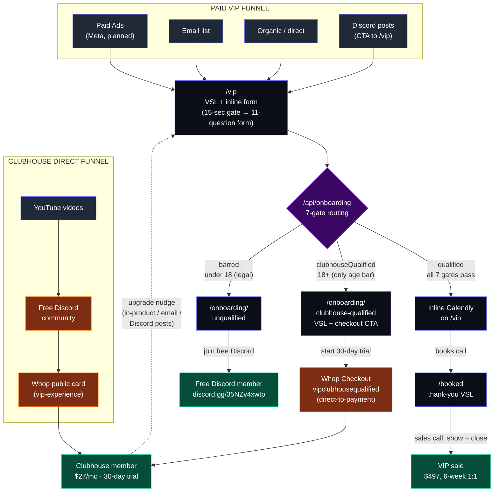

# Funnel Map

Two parallel acquisition funnels feed three terminal states.

## The two funnels

1. **Paid VIP funnel** — every paid / owned channel (Meta ads, email, Discord posts pushing the offer, organic search, direct) points at `/vip`. Single top of funnel, VSL gate + form, three-way routing.
2. **Clubhouse Direct funnel** — runs in parallel on the side. Typical flow: YouTube content → free Discord community → discover the Clubhouse product on Whop → become a paying Clubhouse member. Some of those members later get pulled back into the VIP funnel via upgrade nudges.

## The three conversion paths to value

| # | Path | Description |
|---|---|---|
| 1 | **Direct VSL** | `/vip` → DQ from VIP → `/onboarding/clubhouse-qualified` VSL → Clubhouse signup. The direct-response VSL pitch we just rebuilt. |
| 2 | **Direct to VIP** | `/vip` → qualified → inline Calendly → sales call → VIP sale ($497). |
| 3 | **VIP via Clubhouse Direct** | YouTube → Discord → Clubhouse member → upgrade nudge → `/vip` form → VIP sale. The longer indirect path through the side funnel. |

## The three terminal states

1. **VIP sale** — $497, 6-week 1:1 with a pro coach. Reached via Calendly + sales call.
2. **Clubhouse member** — $27/mo with 30-day free trial. Reached via Whop checkout.
3. **Free Discord member** — fallback for under-18 visitors blocked at the legal bar.

---

## Visual diagram (Mermaid)

Paste into [mermaid.live](https://mermaid.live) to render — nodes are clickable and open the live page in a new tab.



**The dotted line from Clubhouse member → /vip** is the upgrade loop: Clubhouse members who've been in the community for a while get nudged (in-product banners, email drip, Discord posts) to apply for VIP. They re-enter the same `/vip` funnel and go through the same form / 7-gate routing as cold traffic.

---

## ASCII tree (plain-text version)

```
═════════════════════════════════════════    ═════════════════════════════════
        PAID VIP FUNNEL                            CLUBHOUSE DIRECT FUNNEL
═════════════════════════════════════════    ═════════════════════════════════
├─ Paid Ads (Meta, planned)                  └─ YouTube videos
├─ Email list                                    │
├─ Discord posts (CTA → /vip)                    ▼
├─ Organic / direct                          Free Discord community
        │                                        │
        ▼                                        ▼
    /vip  (VSL + form)                       Whop public card (vip-experience)
        │                                        │
        ▼                                        │
   /api/onboarding (7-gate)                      │
        │                                        │
        ├─ QUALIFIED                             │
        │   └─ Inline Calendly                   │
        │      └─ /booked                        │
        │         └─ VIP sale ($497) ◄───────────┼── (upgrade loop)
        │                                        │
        ├─ CLUBHOUSE-QUALIFIED (18+)             │
        │   └─ /onboarding/clubhouse-qualified   │
        │      └─ Whop Checkout                  │
        │         └─ Clubhouse member ($27/mo) ◄─┘
        │
        └─ BARRED (under 18 only)
            └─ /onboarding/unqualified
               └─ Free Discord member
```

---

## The 7 qualification gates

Defined in [`app/lib/onboarding.ts`](app/lib/onboarding.ts) (function `routeSubmission`). Both this repo's `/api/onboarding` and the canonical form in `rl-clubhouse-onboarding` use the same logic — keep them in sync.

| # | Gate | Bars from VIP? | Bars from Clubhouse? | Notes |
|---|---|---|---|---|
| 1 | Age (12–15 or 16–17) | yes | yes (legal bar) | Hard bar from BOTH paths |
| 2 | Country (not in allowlist) | yes\* | no | High-budget override applies |
| 3 | Employment (only "Unemployed") | yes\* | no | High-budget override applies |
| 4 | Platform (not PC) | yes | no | Console can't run Bakkesmod |
| 5 | Rank (below Plat) | yes | no | VIP targets Plat and above |
| 6 | Player type ("casual") | yes | no | Casual is fine for the community; not fine for a 6-week 1:1 |
| 7 | Budget (under $301/yr) | yes | no | Floor for $497 program |

\*High-budget override: stated budget of $501+ bypasses gates 2 and 3 (clear discretionary income overrides geo and employment proxies).

**The only hard Clubhouse bar is age (under 18).** Everything else is a VIP-only filter. Casual / low-budget / console-only / under-Plat players who aren't a fit will self-filter during the Clubhouse free trial — no upside to gating them out at the form.

---

## Public URL reference

| Step | URL |
|---|---|
| VIP funnel landing | https://vip-experience.vercel.app/vip |
| Clubhouse-qualified outcome | https://vip-experience.vercel.app/onboarding/clubhouse-qualified |
| Unqualified outcome | https://vip-experience.vercel.app/onboarding/unqualified |
| Booked thank-you | https://vip-experience.vercel.app/booked |
| Whop direct-to-checkout (VIP-funnel Clubhouse) | https://whop.com/c/gcbcommunity/vipclubhousequalified |
| Whop public card (Clubhouse-direct funnel entry) | https://whop.com/c/gcbcommunity/vip-experience |
| Free Discord (Clubhouse-direct funnel + unqualified fallback) | https://discord.gg/35NZv4xwtp |
| Calendly (VIP application) | https://calendly.com/rlclubhouse/vip-onboarding |

---

## Notes on the Clubhouse Direct funnel

- The free Discord community is **shared** between the two funnels: it's a top-of-funnel for the Clubhouse Direct flow AND the fallback for under-18 unqualified visitors. Same Discord, two entry reasons.
- The Whop public card (`/c/gcbcommunity/vip-experience`) is the canonical landing for the Clubhouse Direct funnel. It can also be discovered organically inside Whop. Anyone who hits it goes straight to Whop checkout, skipping the VIP/VSL funnel entirely.
- The `/onboarding` route in this repo redirects to `rl-clubhouse.vercel.app/onboarding` (canonical Clubhouse form in the other repo). Same 7-gate routing as `/api/onboarding` here. That form is the primary mechanism for the **upgrade loop** — Clubhouse members can fill it out to apply for VIP.
